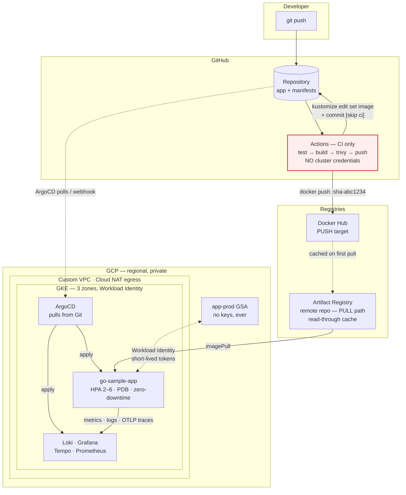

# Go application to production on GKE

A sample Go HTTP service delivered to a regional, private GKE cluster through pull-based GitOps,
with an in-cluster LGTM observability stack. Infrastructure is Terraform, workloads are Kustomize,
delivery is ArgoCD, VM provisioning is Ansible.

Every design decision in this repository is written down next to the code it affects, and the claims
it makes are measured rather than asserted — see [Verified results](#verified-results).

---

## Architecture



**The one arrow that is not there is the point.** Nothing goes from GitHub Actions to the cluster.
CI's only write is a Git commit; ArgoCD, inside the cluster, pulls. Compromise the CI runner and the
attacker gets the ability to make a reviewable, revertible commit — not cluster-admin.

---

## Repository map

| Path | Task | What it is |
|---|---|---|
| [app/](app/) | 0 | Go service — probes, RED metrics, OTLP traces, graceful drain |
| [docker/](docker/) · [.dockerignore](.dockerignore) | 1–2 | Multi-stage build to distroless, pinned by digest |
| [k8s/](k8s/) | 3 | Kustomize `base/` + `overlays/{dev,prod}` |
| [infra/terraform/](infra/terraform/) | 4 | VPC, regional private GKE, IAM + Workload Identity |
| [argocd/](argocd/) | 5 | `AppProject`s and `Application`s |
| [observability/](observability/) | 6 | LGTM Helm values, 3 dashboards, alert rules |
| [.github/workflows/](.github/workflows/) | 7 | CI, and Terraform plan-on-PR |
| [ansible/](ansible/) | 8 | 4 roles: common, docker, nginx_container, node_exporter |

Every directory has its own `README.md` covering the decisions specific to it. This file covers what
spans them.

### Two standalone pages

Both open directly in a browser — no build step, no dependencies. Regenerate the wrapper after
editing either with `./scripts/wrap-standalone-html.sh`.

**[`project-overview.html`](project-overview.html)** — the project in six diagrams: how a commit
reaches a pod, why `maxUnavailable: 0` alone is not zero downtime, how the workload reaches GCP with
no key file, why the Deployment has no `replicas`, the steps, and what is proven versus written.
Start here if you want the shape of the thing in two minutes.

**[`repo-guide.html`](repo-guide.html)** — every folder and file, top to bottom, plus the project
lifecycle and the plan. Start here when the question is "what is this file for?".

Both are excluded from the Docker build context (see `.dockerignore`) — they would otherwise be
transferred to the daemon on every build for no reason.

Between them the two pages collect, in one place, the failure modes in this stack that are
**silent** — a misplaced `.dockerignore`, `ignoreDifferences` without `RespectIgnoreDifferences`, a
Workload Identity pool without `GKE_METADATA`, `docker_container` without `comparisons: strict` —
each of which looks configured and does nothing.

---

## Quickstart

Order matters: infrastructure, then ArgoCD, then everything else arrives through Git.

```bash
# 0. app + image
cd app && go test -race ./... && cd ..
docker buildx build --platform linux/amd64 -f docker/Dockerfile \
  --build-arg VERSION=v1.0.0 --build-arg REVISION="$(git rev-parse HEAD)" \
  -t <dockerhub-user>/go-sample-app:v1.0.0 --push .

# 1. infrastructure  (~15 min)
cd infra/terraform/envs/prod
cp terraform.tfvars.example terraform.tfvars   # project_id + your IP/32
terraform init -backend-config="bucket=<project>-tfstate"
terraform apply

# 2-3. hand the cluster over to ArgoCD — the ONE imperative step in the system
#
# Steps 2 and 3 below are what this script automates. Prefer the script: it also
# refuses to run when the working tree is dirty or HEAD is unpushed, because
# ArgoCD syncs what is in the REMOTE, and bootstrapping a cluster against a
# commit that only exists on your laptop produces a "Synced" badge for code
# nobody else has.
./scripts/bootstrap-cluster.sh <dockerhub-user> <github-owner/repo>

# --- or, the same thing by hand ---------------------------------------------
# 2. substitute the two facts the workload layer needs from the infra layer
terraform output ksa_annotation      # -> k8s/overlays/prod/patches/serviceaccount-wi.yaml
terraform output image_repository    # -> k8s/overlays/prod/kustomization.yaml

# 3. install ArgoCD and point it at Git
eval "$(terraform output -raw get_credentials_command)"
kubectl create namespace argocd
kubectl apply -n argocd -f https://raw.githubusercontent.com/argoproj/argo-cd/v2.13.2/manifests/install.yaml
kubectl -n argocd rollout status deploy/argocd-server --timeout=300s

kubectl -n observability create secret generic grafana-admin \
  --from-literal=admin-user=admin \
  --from-literal=admin-password="$(openssl rand -base64 24)"

kubectl apply -f argocd/projects/
kubectl apply -f argocd/apps/

# 4. from here, Git drives everything. Teardown is two steps:
#    terraform apply -var deletion_protection=false && terraform destroy
```

The published image for this repository, for reference:
**[`dockerpeace/go-sample-app`](https://hub.docker.com/r/dockerpeace/go-sample-app)** —
`v1.0.0` @ `sha256:8357fe65123debb9f2f85017d56d75f7ce62bc19ad448f08dd56d51cc94f719c`.
No `latest` tag exists, by design; see [docker/README.md](docker/README.md).

Ansible ([Task 8](ansible/)) is independent of all of this and needs no cluster.

### Cost-aware alternative

A regional cluster with 3 × `e2-standard-4` runs roughly **US$8–13/day**. Do steps 0–3 against a
local `kind` cluster first, where iteration is free, then run `terraform apply` once to demonstrate
the same GitOps flow on real GKE, capture evidence, and tear down.

---

## The three pillars

### High availability

| Mechanism | Where |
|---|---|
| Regional cluster — control plane and nodes across 3 zones | `modules/gke` `location = region` |
| ≥2 replicas, owned by the HPA (`minReplicas: 2`) | `k8s/base/hpa.yaml` |
| `maxUnavailable: 0`, `maxSurge: 1` | `k8s/base/deployment.yaml` |
| Graceful drain: readiness 503 → 5s → `Shutdown` | `app/main.go` `drain()` |
| PDB `minAvailable: 1` — never blocks a drain | `k8s/base/pdb.yaml` |
| podAntiAffinity across nodes, topologySpread across zones | `k8s/base/deployment.yaml` |
| Three probes with genuinely distinct jobs | `k8s/base/deployment.yaml` |

### Scalability

HPA 2–6 on CPU utilisation of the **request** (there is no CPU limit, deliberately). Node pool
autoscales 1–3 per zone — a floor of 3 and a ceiling of 9. Stateless container, VPC-native cluster
with a Pod range sized for 128 nodes.

### Security

Distroless non-root image pinned by digest, 0 Trivy findings. Full securityContext at pod and
container level, enforced by the `restricted` Pod Security Standard on the namespace. Private nodes,
Cloud NAT egress only, control-plane access restricted by a CIDR list that **rejects `0.0.0.0/0` at
plan time**. Least-privilege node service account instead of the default Compute Engine SA.
Workload Identity — **no service account key exists anywhere**, enforced by a CI check.

---

## Decisions worth defending

Collected here because these are the questions a reviewer will actually ask. Each is expanded in the
relevant directory's README.

### `maxUnavailable: 0` alone does not give zero downtime

It guarantees new pods are ready before old ones go away. It says nothing about requests still in
flight to a pod that is shutting down. That half lives in the application: on SIGTERM, readiness
flips to 503 **first**, then a pause lets kube-proxy remove the pod from the EndpointSlice, and only
then does the listener close.

Measured, under continuous load through a rolling update:

| `SHUTDOWN_DELAY` | Requests | Failed |
|---|---|---|
| 1s | 10,486 | **15** (0.14%) |
| 5s | 8,017 | **0** |

One second is not enough for endpoint propagation. The delay lives in Go code because the runtime
image is distroless — there is no shell, so `preStop.exec: ["sleep","5"]` cannot run.

### The Deployment has no `spec.replicas`

`spec.replicas` + an HPA + ArgoCD `selfHeal` is a three-way fight: the HPA scales to 4, ArgoCD sees
drift against a manifest saying 2 and reverts, the HPA scales up again, forever. So the HPA is the
sole owner and `minReplicas: 2` is where the HA baseline lives.

`ignoreDifferences` on `/spec/replicas` alone is **not sufficient** — without
`RespectIgnoreDifferences=true` in `syncOptions`, selfHeal still reverts the field. It looks
configured and does nothing.

### No CPU limit; memory request == limit

A CPU limit is enforced by CFS quota, which throttles the container even when the node has idle
cores — spare capacity converted into p99 spikes for no benefit. The request already guarantees a
scheduling share and is the HPA's denominator.

Memory is incompressible, so a limit above the request only buys the chance to be OOM-killed after
the scheduler has over-committed. Equal values also give the pod the **Guaranteed** QoS class.

### Workload Identity, not a service account key

A JSON key is a permanent, offline-usable bearer credential that ends up in Terraform state, then a
CI secret store, then a Kubernetes Secret. It does not expire and nothing tells you when it leaks.

Workload Identity replaces it with a trust relationship: Terraform grants
`roles/iam.workloadIdentityUser` to `serviceAccount:<project>.svc.id.goog[prod/go-sample-app]`, the
KSA carries a matching annotation, and pods get short-lived tokens from the metadata server.
No key material is ever created. CI enforces it:

```bash
grep -rE 'resource +"google_service_account_key"' --include='*.tf' .   # must be empty
```

### Two registries, one tag

CI **pushes** to Docker Hub (the assignment's requirement, and it gives a reviewer a browsable URL).
GKE **pulls** through an Artifact Registry remote repository, because every private node egresses via
one Cloud NAT IP and would share a single Docker Hub rate limit — a rollout restarting nine nodes'
worth of pods can exhaust it, producing `ImagePullBackOff` mid-deploy.

A remote repository is a read-through cache and **cannot be pushed to**. CI asserts that `docker.io`
never appears under `k8s/base` or `k8s/overlays/prod`.

### Probe traffic is excluded from every RED query

`/readyz` returns **503 on every graceful shutdown** — by design. Include it in the error-rate alert
and the alert fires on every deploy, which teaches people to ignore the channel. The app makes the
same distinction in its logs: that 503 is `INFO`, not `ERROR`.

### `trace_id` is the join key, and it is a contract

Metrics carry it as an exemplar, logs as a JSON field, traces as the trace itself. That single field
is what makes metric → trace → log navigation work. Because Grafana's Loki derived field matches it
with a regex against the app's log format, changing that format breaks correlation **silently** —
which is why `trace_id` is written into the application contract rather than left as an
implementation detail.

### `.dockerignore` lives at the repository root

The build context is the repo root, and Docker only reads `.dockerignore` from the context root. A
file at `docker/.dockerignore` is silently ignored — the build still succeeds while shipping the
whole repository to the daemon.

### Node sizing is driven by the observability stack

`e2-standard-4`, floor of 1 node per zone. The app requests 200m/256Mi; Prometheus + Loki + Tempo +
Grafana + Alloy want roughly 4–6 vCPU and 8–12 GB. On `e2-medium` the LGTM stack never schedules,
which presents as mysterious `Pending` pods.

The per-zone floor is also load-bearing: LGTM PVCs bind to **zonal** disks, pinning each pod to one
zone. If the autoscaler drained a zone to zero they would go `Pending` and could not recover.

### Two AppProjects

The app project permits seven namespaced kinds and one cluster-scoped kind. A manifest introducing a
`Secret` or `ClusterRoleBinding` is refused rather than applied. The observability stack genuinely
needs to install CRDs and ClusterRoles, so it gets its own project — folding them together would
grant the app pipeline cluster-admin by another route.

---

## Verified results

Everything below was executed, not asserted.

### Application

| Check | Result |
|---|---|
| `go test -race ./...` | 9/9 pass |
| `go vet` · `gofmt -l` | clean |
| Static build | `CGO_ENABLED=0`, asserted with `ldd` at build time |

### Image

| Check | Result |
|---|---|
| Size | 29 MB |
| Runs as | `65532:65532`, non-root |
| Shell present | no — `exec /bin/sh` fails with `stat /bin/sh: no such file or directory` |
| Trivy HIGH+CRITICAL, `--ignore-unfixed` | **0** |
| Graceful drain via `docker kill -s SIGTERM` | `/readyz` → 503 at t+141 ms; listener closed ≈ t+5 s; exit 0 |

### Manifests

| Check | Result |
|---|---|
| `kustomize build` (dev, prod) | 7 resources each |
| `kubeconform -strict` | 7/7 valid, 0 errors, no deprecated APIs |
| `kubectl apply --dry-run=server` | all accepted |
| `kustomize edit set image` | rewrites one line; output byte-identical, selectors untouched |

### On a live cluster

| Check | Result |
|---|---|
| Rollout | `successfully rolled out`, 2/2 ready |
| podAntiAffinity | pods placed on two different nodes |
| HPA with **no metrics-server at all** | raised 1 → 2 in ~5 s (`AbleToScale=True reason=SucceededRescale`) |
| PDB | `ALLOWED DISRUPTIONS: 1` |
| ConfigMap plumbing | `GREETING` from `config.env` appeared in the response body |
| `restricted` PSS | rejected an ad-hoc `kubectl run` pod; app pods admitted cleanly |
| Rolling update under load | **8,017 requests, 0 failures** |

### Infrastructure

| Check | Result |
|---|---|
| `terraform fmt -check -recursive` | clean |
| `terraform validate` | valid (provider `hashicorp/google v6.50.0`) |
| `0.0.0.0/0` in `master_authorized_networks` | rejected by variable validation |
| `google_service_account_key` | zero occurrences |

### Everything else

| Check | Result |
|---|---|
| `hadolint` (Dockerfile) | 0 findings |
| `ansible-lint` | 0 failures, 0 warnings — meets the **production** profile |
| `ansible-playbook --syntax-check` | passes |
| `yamllint` (47 files) | 0 findings |
| `actionlint` (workflows) | 0 findings |
| `shellcheck` (`scripts/`) | 0 findings |
| `gitleaks` (working tree + history) | no leaks found |
| `trivy config` on **rendered** manifests | 0 HIGH / 0 CRITICAL — 41 of 42 policies pass |
| `./scripts/check-invariants.sh` | 7/7 hold |

> `trivy config` must run on **rendered** output, not the source tree. Against `k8s/` directly it
> reads `overlays/*/patches/*.yaml` as complete Deployments — they are strategic-merge fragments, so
> it reports 2 spurious HIGH "default security context" findings for manifests that are fully
> hardened once merged. CI renders first, for that reason.

### Reproduce it all

```bash
./scripts/check-invariants.sh      # the 7 repository invariants, locally
```

Every tool above runs in a container, so none of it requires a local install beyond Docker — see
each directory's README for the exact commands.

---

## Trade-offs, and what I would do next

Things deliberately left undone, with the reasoning — because knowing what you skipped is part of
knowing what you built.

**No Ingress, Gateway or TLS.** The Service is `ClusterIP`. Doing this properly means an Ingress or
HTTPRoute plus cert-manager and a WAF policy — a task of its own. A `LoadBalancer` Service was the
available shortcut: a billable external IP serving plaintext HTTP with no policy in front. Not used
on purpose.

**No NetworkPolicy manifests**, even though Dataplane V2 is enabled and would enforce them. The
honest next step is a default-deny policy per namespace plus explicit allows — and Dataplane V2 is
already in place precisely so that is a manifest change rather than a cluster rebuild.

**Public control-plane endpoint, CIDR-restricted.** `enable_private_endpoint = true` is stronger and
is what production should do, but then `kubectl` only works from inside the VPC, so a bastion or
Connect Gateway must exist *before* the cluster can be bootstrapped. Deliberately decided rather than
left implicit, because the ArgoCD bootstrap has to work.

**No cosign signing or admission policy.** Keyless cosign in CI plus a policy controller refusing
unsigned images would close the loop between "CI built it" and "the cluster will run it". Roughly a
day of work and the natural next increment.

**No External Secrets Operator.** Nothing in this deployment needs a secret — the app calls no
external API, and Workload Identity removes the usual credential. The Grafana admin password is
created out of band, which is the one place ESO would be applied first.

**Mimir instead of Prometheus, at scale.** A single Prometheus with a 50 GB zonal disk is right for
one cluster. Mimir is horizontally scalable and object-storage backed, with an unchanged query API.

**Tail-based sampling.** Traces are sampled at 100%, correct at assignment volume and a cost and
cardinality problem at real traffic. Tail-based sampling in Alloy keeps every erroring and slow trace
and samples the rest.

**SLOs and burn-rate alerting.** `AppHighErrorRate > 5%` is a reasonable starting threshold, not a
stated reliability objective. Multi-window burn-rate alerts against an error budget page
proportionally to how fast the budget is being spent.

**Multi-environment promotion.** One `prod` overlay and a `dev` overlay used for local testing. Real
promotion is an `ApplicationSet` generating an Application per environment, with the image tag
flowing dev → staging → prod as separate commits.

**GCS backends for Loki and Tempo.** Currently filesystem-backed, to avoid requiring a bucket and an
IAM binding for a demo. Object storage is cheaper, survives the pod, and decouples retention from
disk size — one values change plus a Workload Identity annotation.

**Molecule tests for the Ansible roles.** Idempotency is verified by running the playbook twice; real
role testing across two distributions is a task of its own.
